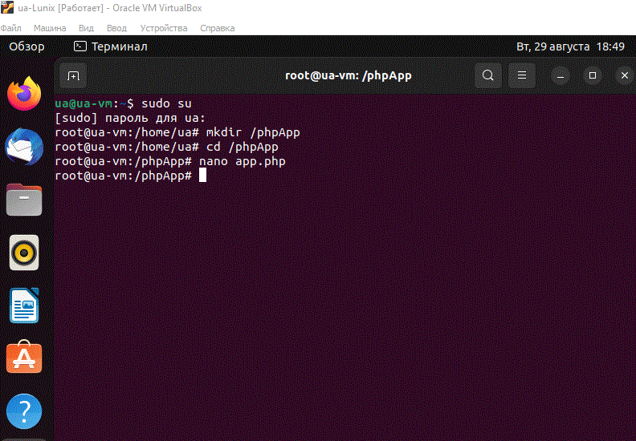
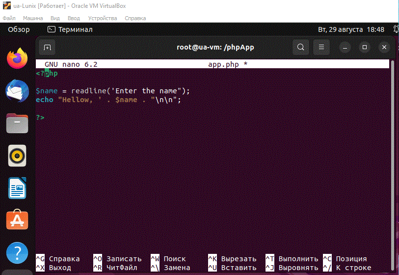
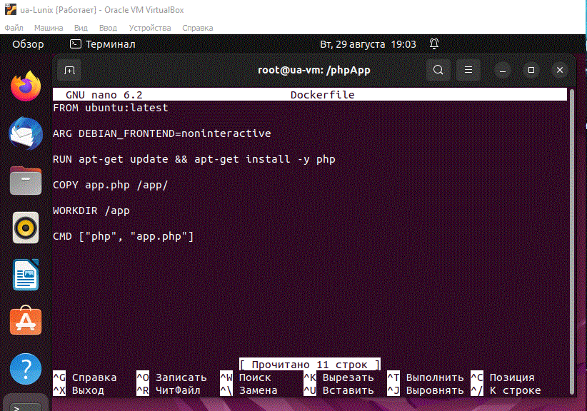
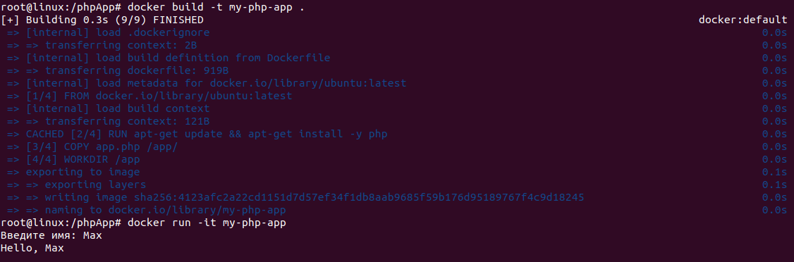

# Домашнее задание по семинару "Урок 4. Dockerfile и слои"

## Необходимо создать Dockerfile, основанный на любом образе (вы в праве выбрать самостоятельно). В него необходимо поместить приложение, написанное на любом известном вам языке программирования (Python, Java, C, С#, C++). При запуске контейнера должно запускаться самостоятельно написанное приложение.

1. Создаём папку `phpApp` и в ней создаём файл `app.php` с php-скриптом.

2. В той же папке создаём Dockerfile.

3. Затем ввёл команду на сборку докерфайла и на запуск контейнера. Программа отработала!

